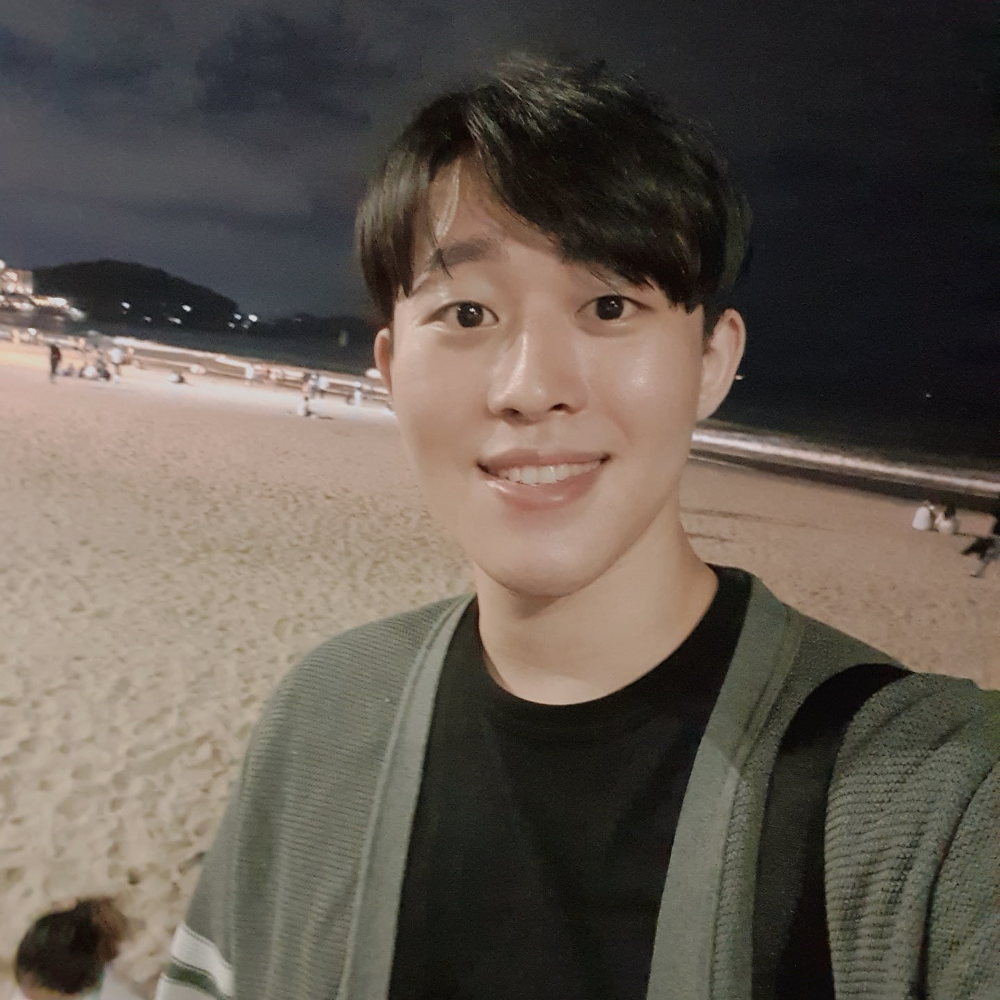

# 백엔드 개발자 장인혁

## 👦🏻 Profile

- TEL. 010-5718-4620
- E-MAIL. v7153623@ajou.ac.kr
- Instagram [https://www.instagram.com/linga_jang/](https://www.instagram.com/linga_jang/)
- Git-hub. [https://github.com/v7153623](https://github.com/v7153623)

 

## 👨‍💻 **SKILLS**

---

     

   

 indicates the tech stacks that I am familiar with

 indicates the tech stacks that I have used to some extent in classes.

 indicates the tech stacks that I am currently learning

 

## 🎓 EXPERIENCE

---

- 2022.07 ~ 현 재 삼성 청년 SW 아카데미 8기 재학중
- 2017.03 ~ 2022.08 아주대학교 소프트웨어과, 환경안전공학과 복수전공

 

## 🏆 Awards / Certificates

---

- 2023.04 SSAFY 특화 프로젝트 우수상
- 2023.03 OPIC - IH
- 2022.12 SQLD (한국데이터산업진흥원)
- 2017.09 운전면허 2종 보통 (경기도 경찰청)

 

## 👨🏻‍💻 Project Summary

---

 

- 2023.02.20 ~ 2023.04.07 머무르다

   “머무르다” 는 NFT 게임요소를 갖고있는 SNS 입니다.
  “어린왕자”에서 아이디어를 얻어 구상한 프로젝트이며, 어린왕자 별 B612처럼 개인이 자신만의 행성을 갖게되고, 이를 NFT를 통해 사고 팔 수 있습니다.
  
  NFT는 따로 마켓을 백엔드에서 구현할 필요 없이 스마트 컨트랙트를 통해 유저간 거래가 쉽기도 하지만, 기획적으로 유저가 자기 행성이 자기만의 특별한 행성이라는 생각을 주고 싶어 사용했습니다.
  
  저는 조장으로서 jira를 이용한 프로젝트의 전체적인 일정, 진행 관리와 기획, 발표를 맡았고 
  개발 쪽으로는 백엔드 파트 전체를 맡아 jpa를 이용해 db를 구성시키고, 서버를 구성해 DB에서 필요한 정보를 가져와 FE에 넘기거나, DB에 정보를 저장할 수 있게 했습니다.
  
  머무르다는 SSAFY 특화 프로젝트 중 우수 프로젝트로 선정되어 수상했습니다.
  
  배포된 주소입니다. https://www.b612.shop
  
  
  
   
  
- 2023.01.03 ~ 2023.02.17 몃땃쥐 (MTC)

   몃땃쥐는 20대를 겨냥한 가벼운 SNS입니다.
  인스타 그램의 피드 관리를 해야한다는 점과 글을 쓰기가 어렵다는 점을 개선하려고 노력했습니다.
  MTC는 제목과 사진 한 장, 그리고 원한다면 해시태그만을 작성해 글을 작성하고, 유저들은 올라온 사진을 가볍게 평가하며 즐길 수 있는 SNS 였습니다.

  저는 기획과 백엔드, DB, 발표를 맡았습니다.

  JPA를 이용해 mysql 쿼리 없이 DB를 구성하고, comment와 article, reply와 관련된 백엔드 파트의 코드를 작성했습니다.

  팀원 모두가 MyBatis만을 사용해봐서 jpa 에서 entity간 연결 후 식별과 비식별 관계를 줘야하는 것을 어려워해서
  제가 먼저 공부해 팀원들에게 가르쳐 주기도 했었습니다.

  프로젝트는 성공적이었고, 일주일의 베타테스트 기간에 100명 이상의 유저와 400개 이상의 글을 확보했고, 40명의 유저중 39명의 유저에게 긍정평가를 받았습니다.

  

 

- 2022.11.15 ~ 2022.11.25 Find your B612

   find your B612는 부동산 실거래가를 조회하는 프로그램입니다.
  
  공공데이터 포탈에서 부동산 실거래가를 받아와 사용하고, 카카오 api로 카카오 맵을 받아와서 좌표도 표시하고,
  네이버 api를 통해 네이버 뉴스에서 부동산과 관련이 있는 뉴스들을 크롤링해서 보여줬습니다.
  
  해당 프로젝트에서 DB와 백엔드 일부, mapper전체 query 작성, 네이버 api, 공공 데이터 받아오기와 발표를 맡았습니다.
  
  처음으로 백엔드 엔지니어를 맡은 프로젝트이기도 했습니다.

